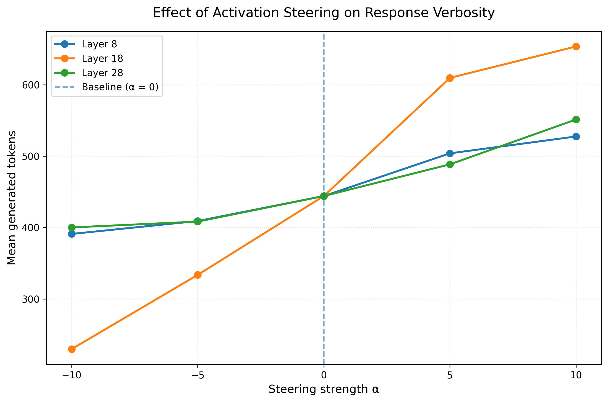

# Activation Steering for Controlling LLM Verbosity

## Overview

This project investigates whether activation steering can be used to control the verbosity of responses generated by an instruction-tuned language model.

The main idea is to extract a direction in activation space associated with detailed vs. concise responses, and then intervene on the model's activations during generation.

The project is primarily an educational experiment in mechanistic interpretability and activation steering.

## Research Question

> Can activation-level interventions control the verbosity of an instruction-tuned language model?

## Hypothesis

A direction computed from the difference between activations associated with detailed and concise responses can be used to increase or decrease response verbosity.

## Model

**Qwen2.5-3B-Instruct**

The model has 36 transformer layers and a hidden dimension of 2048.

## Dataset

The experiment currently uses **30 prompts**.

- **20 prompts** are used to construct the steering directions.
- **10 prompts** are held out for evaluation.

The held-out prompts do not contain explicit instructions to be concise or detailed. This allows the experiment to test whether the learned activation direction affects verbosity on new prompts.

## Method

The experiment follows these steps:

1. Construct prompts that elicit either detailed or concise responses.
2. Extract the final-token activation from selected transformer layers.
3. Compute a steering direction from the difference between mean detailed and concise activations.
4. Normalize the steering direction.
5. Inject the steering direction into selected transformer layers during generation.
6. Evaluate different steering strengths.
7. Measure the effect on generated response length.

The steering direction is computed as:

$$ 
v = \mathrm{mean}(H_{\text{detailed}}) - \mathrm{mean}(H_{\text{concise}}) 
$$

The basic intervention is:

$$
h'_l = h_l + \alpha v
$$

where:

- $h_l$ is the activation at layer $l$
- $v$ is the steering direction
- $\alpha$ is the steering strength

Generated token count is used as the primary quantitative measure of verbosity.

## Experimental Setup

Three intervention layers have currently been tested:

- Layer 8
- Layer 18
- Layer 28

Five steering strengths are evaluated:

$$
\alpha \in \lbrace -10, -5, 0, 5, 10 \rbrace
$$

Each configuration is evaluated on the same **10 held-out prompts**.

The maximum generation length is 1024 tokens, and none of the current held-out generations were truncated.

## Preliminary Results

The initial results show a clear relationship between steering strength and response length across all three tested layers.

The results show that:

- Increasing $\alpha$ consistently increases response length.
- Decreasing $\alpha$ generally decreases response length.
- The effect is substantially stronger at **layer 18** than at layers 8 and 28.
- At layer 18, mean response length ranges from **229.7 tokens** at $\alpha=-10$ to **653.6 tokens** at $\alpha=+10$.
- No generations in the current experiment reached the 1024-token limit.

These results are preliminary and should not yet be interpreted as evidence that layer 18 is universally optimal.

## Current Status

### Completed

- [x] Baseline generation experiments
- [x] Prompt dataset construction
- [x] Steering directions computing for layers 8, 18, and 28
- [x] Activation intervention during generation
- [x] Held-out evaluation on 10 prompts
- [x] Comparison of steering strengths
- [x] Initial visualization of layer-wise results

### Next Steps

- [ ] Analyze per-prompt changes relative to the $\alpha=0$ baseline
- [ ] Compare the consistency of the effect across individual prompts
- [ ] Add uncertainty/error information to the aggregate results
- [ ] Inspect qualitative examples of steered responses
- [ ] Evaluate the full 30-prompt dataset as a secondary analysis
- [ ] Finalize figures and experimental tables
- [ ] Discuss limitations and failure cases
- [ ] Write final conclusions

## Limitations

This is a small-scale experiment using a single model, a small prompt dataset, and a simple activation-steering method.

The steering direction is constructed from 20 prompts, so evaluation on those same prompts would be in-sample. The 10 held-out prompts are therefore treated as the primary evaluation set.

Generated token count measures response length, but longer responses are not necessarily better or more informative. The current experiment therefore measures **verbosity**, not response quality.

The intervention is also applied at selected transformer layers using a simple additive activation modification. This does not establish that verbosity is represented by a single universal direction in activation space.

Finally, only three intervention layers have been tested so far, so conclusions about layer-specific behavior should be limited to the layers investigated here.
